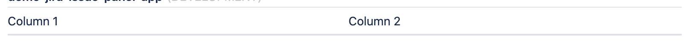
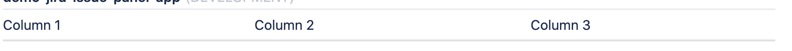
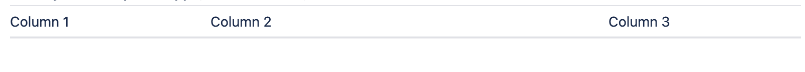
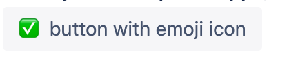
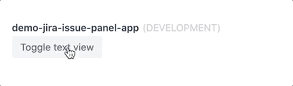
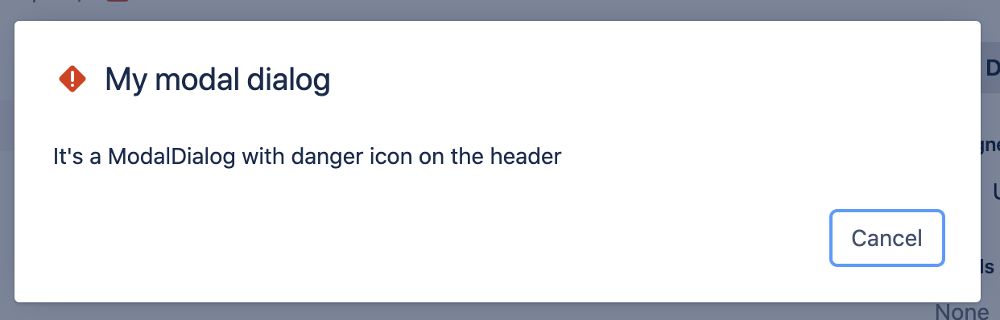
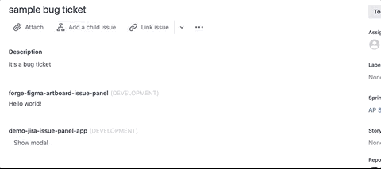

<p align="center" style="margin-bottom: -20px">
  
</p>

# Common UI components using FORGE UI

This is a quick reference and showcase of standard UI components using the **Forge UI**. For complete info, see [Forge UI components developer documentation](https://developer.atlassian.com/platform/forge/ui-components/).

# WHY?

- It's common to think your Forge apps UI in terms of standard UI components(example: Carousel, Pagination, ...), but _FORGE UI_ has very few components. It's an attempt to build standard UI components using **[FORGE UI](https://developer.atlassian.com/platform/forge/ui-components/)**
- **DON"T REINVENT THE WHEEL**, use already existing standard _UI pattern_ and _reuse_ in your app.

### Table of Contents

- **[Heading](#Heading)**<br>
- **[Link](#Link)**<br>
- **[List](#List)**<br>
- **[Code](#Code)**<br>
- **[Button](#Button)**<br>
- **[ButtonSet](#ButtonSet)**<br>
- **[Layout](#Layout)**<br>
- **[Image](#Image)**<br>
- **[Icons](#Icons)**<br>
- **[Carousel](#Carousel)**<br>
- **[Video](#Video)**<br>
- **[Collapse](#Collapse)**<br>
- **[Progress](#Progress)**<br>
- **[Pagination](#Pagination)**<br>
- **[Chart](#Chart)**<br>
- **[Alert](#Alert)**<br>
- **[Modal](#Modal)**<br>
- **[Navbar](#Navbar)**<br>

# Heading

It's tempting to think about heading with HTML header tags (h1 to h6). But, we need to understand [Forge](https://www.atlassian.com/forge) apps are embedded in the Atlassian products (JIRA, Confluence page ..,). Consider using **strong text** or _emphasis text_ for **important** or **header** content.

## Strong text


```
  <Text> **It's a strong text**</Text>
  <Text> __It's a strong text__</Text>
```

### Forge UI components used

1. [Strong text with star and underscore](https://developer.atlassian.com/platform/forge/ui-components/text/#text)

## Emphasis text


```
  <Text> *It's a emphasis text*</Text>
  <Text> _It's a emphasis text_</Text>
```

### Forge UI components used

1. [Emphasis text with star and underscore](https://developer.atlassian.com/platform/forge/ui-components/text/#text)

# Link


```
<Text>
  [It's a link to my
  project](https://github.com/anilkk/ui-component-with-forge-ui)
</Text>
```

### Forge UI components used

1. [Text with link markdown](https://developer.atlassian.com/platform/forge/ui-components/text/#text)

# List

## Unordered list


```jsx
<Text> - Item 1 </Text>
<Text> - Item 2 </Text>
<Text> - Item 3 </Text>
<Text> - Item 4 </Text>
```

### Forge UI components used

1.  [Text](https://developer.atlassian.com/platform/forge/ui-components/text/#text)

## Ordered list


```jsx
<Text> 1. Item 1 </Text>
<Text> 2. Item 2 </Text>
<Text> 3. Item 3 </Text>
<Text> 4. Item 4 </Text>
```

### Forge UI components used

1. [Text](https://developer.atlassian.com/platform/forge/ui-components/text/#text)

# Code


```jsx
const sampleCode = `<Button text="sample button" onClick={() => { console.log('do some action')}}/>`;
return (
  <Fragment>
    <Text>{sampleCode}</Text>
  </Fragment>
);
```

### Forge UI components used

1. [Text with markdown for code ](https://developer.atlassian.com/platform/forge/ui-components/text/)

### Note

1.  ⚠️ Passing code as a string might not work. Example: I tried to Forge UI component, it doesn't work. But, if you give as a reference, it works as shown in the above code sample.

# Button


```jsx
<Button text="demo button" onClick={() => console.log('perform action')} />
```

### Forge UI components used

1. [Button](https://developer.atlassian.com/platform/forge/ui-components/button/)

# ButtonSet


```jsx
<ButtonSet>
  <Button text="demo button 1" onClick={() => console.log('perform action')} />
  <Button text="demo button 2" onClick={() => console.log('perform action')} />
</ButtonSet>
```

### Forge UI components used

1. [ButtonSet](https://developer.atlassian.com/platform/forge/ui-components/button-set/)
2. [Button](https://developer.atlassian.com/platform/forge/ui-components/button/)

# Layout

### Two columns



```jsx
<Image
  src="https://images.unsplash.com/photo-1560969184-10fe8719e047?auto=format&fit=crop&w=1200&q=50"
  alt="Berlin"
/>
```

### Three columns



```jsx
<Image
  src="https://images.unsplash.com/photo-1560969184-10fe8719e047?auto=format&fit=crop&w=1200&q=50"
  alt="Berlin"
/>
```

### Columns with spacing



```jsx
<Image
  src="https://images.unsplash.com/photo-1560969184-10fe8719e047?auto=format&fit=crop&w=1200&q=50"
  alt="Berlin"
/>
```

### Forge UI components used

1. [Table](https://developer.atlassian.com/platform/forge/ui-components/table/)

### Note

1. ⚠️ Be careful while using Table cells as a column, same UI is also rendred on the mobile apps.

# Image

You don't have the option to style image(example: width and height). It's good practice to pass formatted images with _right dimention_ and _style_.


```jsx
<Image
  src="https://images.unsplash.com/photo-1560969184-10fe8719e047?auto=format&fit=crop&w=1200&q=50"
  alt="Berlin"
/>
```

## Thumbnail image


```jsx
<Image
  src="https://res.cloudinary.com/anilkumark/image/upload/c_thumb,w_200,g_face/v1589315094/projects/forge/ui-components/photo-1560969184-10fe8719e047_hfksqn.jpg"
  alt="Berlin"
/>
```

## Round image


```jsx
<Image
  src="https://res.cloudinary.com/anilkumark/image/upload/w_1000,c_fill,ar_1:1,g_auto,r_max,bo_5px_solid_red,b_rgb:262c35/v1589315094/projects/forge/ui-components/photo-1560969184-10fe8719e047_hfksqn.jpg"
  alt="Berlin"
/>
```

### Forge UI components used

1. [Image](https://developer.atlassian.com/platform/forge/ui-components/image/)

### Note

1. You can't style using CSS and so use _3rd party_ services like [cloudinary](https://cloudinary.com/) to customize your image if possible.

# Icons

You can use a small [Image](#Image) component, or you can also use emoji as an icon with text.



```jsx
<Button text="✅ button with emoji icon" />
```

### Forge UI components used

1. [Image](https://developer.atlassian.com/platform/forge/ui-components/image/)

### Note

1. You can find a collection of emojis on [getemoji](https://getemoji.com/) and [emojipedia](https://emojipedia.org/).

# Carousel


```jsx
const [images] = useState(() => {
  // You can make API call here
  return imageUrls;
});
const [currentIndex, setCurrentIndex] = useState(0);
return (
  <Fragment>
    <Text>**Carousel demo**</Text>
    <Table>
      <Row>
        <Cell>
          <Button
            text="<"
            onClick={() => {
              setCurrentIndex(
                currentIndex === 0 ? images.length - 1 : currentIndex - 1
              );
            }}
          />
        </Cell>
        <Cell>
          <Image src={images[currentIndex]} />
        </Cell>
        <Cell>
          <Button
            text=">"
            onClick={() => {
              setCurrentIndex(
                currentIndex === images.length - 1 ? 0 : currentIndex + 1
              );
            }}
          />
        </Cell>
      </Row>
    </Table>
  </Fragment>
);
```

### Forge UI components used

1. [Image](https://developer.atlassian.com/platform/forge/ui-components/image/)
2. [Button](https://developer.atlassian.com/platform/forge/ui-components/button/)
3. [Table](https://developer.atlassian.com/platform/forge/ui-components/table/)

### Forge UI hooks used

1. [useState](https://developer.atlassian.com/platform/forge/ui-hooks-reference/#usestate)

### Note

1.  You may expect **delay**, and you don't have a smooth transition effect.

# Video

It's not a video component; it's just a fallback with _image_ and _link_.


```jsx
  <Image
    src="https://res.cloudinary.com/anilkumark/image/upload/v1589197328/projects/forge/ui-components/Group_4_3_w6zihu.png"
    alt="forge tunnel debug"
  />
  <Text>
    [**Play Demo of Forge tunnel debug ▶️**](https://youtu.be/1AlzjCsczV4)
  </Text>
```

### Forge UI components used

1. [Image](https://developer.atlassian.com/platform/forge/ui-components/image/)
2. [Text with link markdown](https://developer.atlassian.com/platform/forge/ui-components/text/#text)

### Note

1. Yes, it's not a video component, it's just a fallback with image and link.

# Collapse



```jsx
const [isOpen, setIsOpen] = useState(false);
<Button
  text="Toggle text view"
  onClick={() => {
    setIsOpen(!isOpen);
  }}
/>;
{
  isOpen && <Text>It's a collapsable text content</Text>;
}
```

### Forge UI components used

1. [Button](https://developer.atlassian.com/platform/forge/ui-components/button/)
1. [Text](https://developer.atlassian.com/platform/forge/ui-components/text/)

# Chart

Using 3rd party service [quickchart](https://quickchart.io/documentation/).


```jsx
<Image
  src="https://quickchart.io/chart?bkg=white&c={type:%27bar%27,data:{labels:[2012,2013,2014,2015,2016],datasets:[{label:%27Users%27,data:[120,60,50,180,120]}]}}"
  alt="progress"
/>
```

### Forge UI components used

1. [Image](https://developer.atlassian.com/platform/forge/ui-components/image/)

### Note

1.  For more details refer to the documentation [quickchart](https://quickchart.io/documentation/).

### Forge UI components used

1. [Image](https://developer.atlassian.com/platform/forge/ui-components/image/)

# Progress

Using 3rd party service [quickchart](https://quickchart.io/documentation/).

```jsx
<Image
  src="https://quickchart.io/chart?c={type:'radialGauge',data:{datasets:[{data:[70],backgroundColor:'blue'}]}}"
  alt="progress"
/>
```


### Forge UI components used

1. [Image](https://developer.atlassian.com/platform/forge/ui-components/image/)

### Note

1.  For more details refer to the documentation [quickchart](https://quickchart.io/documentation/).

# Pagination


```jsx
const handleClick = (buttonPressed) => {
  console.log('buttonPressed ---->', buttonPressed);
};

<ButtonSet>
  <Button
    text="Previous"
    onClick={(event) => {
      console.log('EVENT ---->', event);
      handleClick('Previous');
    }}
  />
  <Button
    text="2"
    onClick={() => {
      handleClick(2);
    }}
  />
  <Button
    text="3"
    onClick={() => {
      handleClick(3);
    }}
  />
  <Button
    text="4"
    onClick={() => {
      handleClick(4);
    }}
  />
  <Button
    text="Next"
    onClick={() => {
      handleClick('Next');
    }}
  />
</ButtonSet>;
```

### Forge UI components used

1. [Button](https://developer.atlassian.com/platform/forge/ui-components/button/)
2. [ButtonSet](https://developer.atlassian.com/platform/forge/ui-components/text/#button-set)

# Alert

## Using Lozenge

Alerts are available for any length of text. For proper styling, use one of the six **appearance** value (e.g., .inprogress).


```jsx
      <Text>
        <Lozenge text="A simple default alert" appearance="default" />
      </Text>
      <Text>
        <Lozenge text="A simple primary alert" appearance="inprogress" />
      </Text>
      <Text>
        <Lozenge text="A simple info alert" appearance="new" />
      </Text>
      <Text>
        <Lozenge text="A simple warning alert ⚠️" appearance="moved" />
      </Text>
      <Text>
        <Lozenge text="A simple danger alert ⛔" appearance="removed" />
      </Text>
      <Text>
        <Lozenge text="A simple success alert ✅" appearance="success" />
      </Text>
```

## Using ModalDialog

#### Danger ModelDialog



```jsx
const [isOpen, setIsOpen] = useState(false);

<Button text="Show modal" onClick={() => setIsOpen(true)} />;
{
  isOpen && (
    <ModalDialog
      header="My modal dialog"
      onClose={() => setIsOpen(false)}
      appearance="danger"
    >
      <Text>It's a ModalDialog danger on the header</Text>
    </ModalDialog>
  );
}
```

#### Warning ModelDialog


```jsx
const [isOpen, setIsOpen] = useState(false);

<Button text="Show modal" onClick={() => setIsOpen(true)} />;
{
  isOpen && (
    <ModalDialog
      header="My modal dialog"
      onClose={() => setIsOpen(false)}
      appearance="warning"
    >
      <Text>It's a ModalDialog warning on the header</Text>
    </ModalDialog>
  );
}
```

### Forge UI components used

1. [Text](https://developer.atlassian.com/platform/forge/ui-components/text/#text)
2. [Lozenge](https://developer.atlassian.com/platform/forge/ui-components/text/#lozenge)
3. [ModalDialog](https://developer.atlassian.com/platform/forge/ui-components/modal-dialog)

# Modal



```jsx
const [isOpen, setOpen] = useState(false);
<Button text="Show modal" onClick={() => setOpen(true)} />;
{
  isOpen && (
    <ModalDialog header="My modal dialog" onClose={() => setOpen(false)}>
      <Text>It's a ModalDialog</Text>
    </ModalDialog>
  );
}
```

### Forge UI components used

1. [ModalDialog](https://developer.atlassian.com/platform/forge/ui-components//modal-dialog/)

### Forge UI hooks used

1. [useState](https://developer.atlassian.com/platform/forge/ui-hooks-reference/#usestate)

# Navbar

## Navbar with buttons


```jsx
<Table>
  <Row>
    <Cell>
      <Image
        src="https://res.cloudinary.com/anilkumark/image/upload/c_thumb,w_200,g_face/v1589212010/projects/forge/ui-components/anil-logo_yq4vyu.png"
        alt="demo logo"
      />
    </Cell>
    {/* Create many empty Cell for spacing */}
    <Cell></Cell>
    <Cell></Cell>
    <Cell></Cell>
    <Cell>
      <ButtonSet>
        <Button text="Home" />
        <Button text="About" />
        <Button text="Contact" />
      </ButtonSet>
    </Cell>
  </Row>
</Table>
```

### Forge UI components used

1. [Image](https://developer.atlassian.com/platform/forge/ui-components/image/)
2. [Button](https://developer.atlassian.com/platform/forge/ui-components/button/)
3. [ButtonSet](https://developer.atlassian.com/platform/forge/ui-components/button-set/)
4. [Table](https://developer.atlassian.com/platform/forge/ui-components/table/)

## Navbar with text lnks


```jsx
<Table>
  <Row>
    <Cell>
      <Image
        src="https://res.cloudinary.com/anilkumark/image/upload/c_thumb,w_200,g_face/v1589212010/projects/forge/ui-components/anil-logo_yq4vyu.png"
        alt="demo logo"
      />
    </Cell>
    {/* Create many empty Cell for spacing */}
    <Cell></Cell>
    <Cell></Cell>
    <Cell></Cell>
    <Cell>
      <Text>
        [Home](https://developer.atlassian.com/platform/forge)
        {'  '} {/* For extra spacing */}
        [Reference](https://developer.atlassian.com/platform/forge/manifest-reference/)
        {'  '} {/* For extra spacing */}
        [Help](https://developer.atlassian.com/platform/forge/get-help/)
      </Text>
    </Cell>
  </Row>
</Table>
```

### Forge UI components used

1. [Image](https://developer.atlassian.com/platform/forge/ui-components/image/)
2. [Text with link markdown](https://developer.atlassian.com/platform/forge/ui-components/text/#text)
3. [Table](https://developer.atlassian.com/platform/forge/ui-components/table/)
