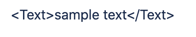

# ui-component-with-forge-ui

This is intended as a quick reference and showcase of common UI components using the **Forge UI**. For more complete info, see [Forge UI components developer documentation](https://developer.atlassian.com/platform/forge/ui-components/).

### Table of Contents

**[Heading](#Heading)**<br>
**[Link](#Link)**<br>
**[List](#List)**<br>
**[Code](#Code)**<br>
**[Button](#Button)**<br>
**[ButtonSet](#ButtonSet)**<br>
**[Layout](#Layout)**<br>
**[Image](#Image)**<br>
**[Icons](#Icons)**<br>
**[Carousel](#Carousel)**<br>
**[Video](#Video)**<br>
**[Accordion](#Accordion)**<br>
**[Alert](#Alert)**<br>
**[Modal](#Modal)**<br>
**[Navbar](#Navbar)**<br>

# Heading

It's tempting to think heading with HTML header tags (h1 to h2). But, we need to understand [Forge](https://www.atlassian.com/forge) apps are embeded in the Atlassian products (JIRA, Confluence, page).

## Strong text

```
  <Text> **It's a strong text**</Text>
  <Text> __It's a strong text__</Text>
```


### Forge UI components used

1. [Strong text with star and underscore](https://developer.atlassian.com/platform/forge/ui-components/text/#text)

## Emphasis text

```
  <Text> *It's a emphasis text*</Text>
  <Text> _It's a emphasis text_</Text>
```


### Forge UI components used

1. [Emphasis text with star and underscore](https://developer.atlassian.com/platform/forge/ui-components/text/#text)

# Link

```
<Text>
  [It's a link to my
  project](https://github.com/anilkk/ui-component-with-forge-ui)
</Text>
```


### Forge UI components used

1. [Text with link markdown](https://developer.atlassian.com/platform/forge/ui-components/text/#text)

# List

## unordered list

```jsx
<Text> - Item 1 </Text>
<Text> - Item 2 </Text>
<Text> - Item 3 </Text>
<Text> - Item 4 </Text>
```


### Forge UI components used

1.  [Text](https://developer.atlassian.com/platform/forge/ui-components/text/#text)

## ordered list

```jsx
<Text> 1. Item 1 </Text>
<Text> 2. Item 2 </Text>
<Text> 3. Item 3 </Text>
<Text> 4. Item 4 </Text>
```


### Forge UI components used

1.  [Text](https://developer.atlassian.com/platform/forge/ui-components/text/#text)

# Code

```jsx
const sampleCode = `<Button text="sample button" onClick={() => { console.log('do some action')}}/>`;
return (
  <Fragment>
    <Text>{sampleCode}</Text>
  </Fragment>
);
```



### Forge UI components used

1. [Text with markdown for code ](https://developer.atlassian.com/platform/forge/ui-components/text/)

# Button

```jsx
<Button text="demo button" onClick={() => console.log('perform action')} />
```


### Forge UI components used

1. [Button](https://developer.atlassian.com/platform/forge/ui-components/button/)

# ButtonSet

```jsx
<ButtonSet>
  <Button text="demo button 1" onClick={() => console.log('perform action')} />
  <Button text="demo button 2" onClick={() => console.log('perform action')} />
</ButtonSet>
```


### Forge UI components used

1. [ButtonSet](https://developer.atlassian.com/platform/forge/ui-components/button-set/)
2. [Button](https://developer.atlassian.com/platform/forge/ui-components/button/)

# Layout

Coming soon ...

# Image

```jsx
<Image
  src="https://images.unsplash.com/photo-1560969184-10fe8719e047?auto=format&fit=crop&w=1200&q=50"
  alt="Berlin"
/>
```


### Forge UI components used

1. [Image](https://developer.atlassian.com/platform/forge/ui-components/image/)

# Icons

Coming soon ...

# Carousel

```jsx
const [images] = useState(() => {
  // You can make API call here
  return imageUrls;
});
const [currentIndex, setCurrentIndex] = useState(0);
return (
  <Fragment>
    <Text>**Carousel demo**</Text>
    <Table>
      <Row>
        <Cell>
          <Button
            text="<"
            onClick={() => {
              setCurrentIndex(
                currentIndex === 0 ? images.length - 1 : currentIndex - 1
              );
            }}
          />
        </Cell>
        <Cell>
          <Image src={images[currentIndex]} />
        </Cell>
        <Cell>
          <Button
            text=">"
            onClick={() => {
              setCurrentIndex(
                currentIndex === images.length - 1 ? 0 : currentIndex + 1
              );
            }}
          />
        </Cell>
      </Row>
    </Table>
  </Fragment>
);
```


### Forge UI components used

1. [Image](https://developer.atlassian.com/platform/forge/ui-components/image/)
2. [Button](https://developer.atlassian.com/platform/forge/ui-components/button/)
3. [Table](https://developer.atlassian.com/platform/forge/ui-components/table/)

### Forge UI hooks used

4. [useState](https://developer.atlassian.com/platform/forge/ui-hooks-reference/#usestate)

### Note

1.  You may expect **delay** and you don't have smooth transition effect

# Video

```jsx
  <Image
    src="https://res.cloudinary.com/anilkumark/image/upload/v1589197328/projects/forge/ui-components/Group_4_3_w6zihu.png"
    alt="forge tunnel debug"
  />
  <Text>
    [**Play Demo of Forge tunnel debug ▶️**](https://youtu.be/1AlzjCsczV4)
  </Text>
```


### Forge UI components used

1. [Image](https://developer.atlassian.com/platform/forge/ui-components/image/)
2. [Text with link markdown](https://developer.atlassian.com/platform/forge/ui-components/text/#text)

### Note

1. Yes, it's not a video component, it's just a fallback.

# Accordion

Coming soon ...

# Chart

<!---
Quick chart
https://quickchart.io/
-->

Coming soon ...

# Progress

<!---
Quick chart progress
https://quickchart.io/
https://getbootstrap.com/docs/4.4/components/progress/
-->

Coming soon ...

# Pagination

<!---
https://getbootstrap.com/docs/4.4/components/pagination/
<nav aria-label="Page navigation example">
  <ul class="pagination">
    <li class="page-item"><a class="page-link" href="#">Previous</a></li>
    <li class="page-item"><a class="page-link" href="#">1</a></li>
    <li class="page-item"><a class="page-link" href="#">2</a></li>
    <li class="page-item"><a class="page-link" href="#">3</a></li>
    <li class="page-item"><a class="page-link" href="#">Next</a></li>
  </ul>
</nav>
-->

Coming soon ...

# Alert

Alerts are available for any length of text. For proper styling, use one of the six **appearance** value (e.g., .inprogress).

```jsx
      <Text>
        <Lozenge text="A simple default alert" appearance="default" />
      </Text>
      <Text>
        <Lozenge text="A simple primary alert" appearance="inprogress" />
      </Text>
      <Text>
        <Lozenge text="A simple info alert" appearance="new" />
      </Text>
      <Text>
        <Lozenge text="A simple warning alert ⚠️" appearance="moved" />
      </Text>
      <Text>
        <Lozenge text="A simple danger alert ⛔" appearance="removed" />
      </Text>
      <Text>
        <Lozenge text="A simple success alert ✅" appearance="success" />
      </Text>
```


### Forge UI components used

1. [Text](https://developer.atlassian.com/platform/forge/ui-components/text/#text)
2. [Lozenge](https://developer.atlassian.com/platform/forge/ui-components/text/#lozenge)

# Modal

Coming soon ...

# Navbar

## Navbar with buttons

```jsx
<Table>
  <Row>
    <Cell>
      <Image
        src="https://res.cloudinary.com/anilkumark/image/upload/c_thumb,w_200,g_face/v1589212010/projects/forge/ui-components/anil-logo_yq4vyu.png"
        alt="demo logo"
      />
    </Cell>
    {/* Create many empty Cell for spacing */}
    <Cell></Cell>
    <Cell></Cell>
    <Cell></Cell>
    <Cell>
      <ButtonSet>
        <Button text="Home" />
        <Button text="About" />
        <Button text="Contact" />
      </ButtonSet>
    </Cell>
  </Row>
</Table>
```


### Forge UI components used

1. [Image](https://developer.atlassian.com/platform/forge/ui-components/image/)
2. [Button](https://developer.atlassian.com/platform/forge/ui-components/button/)
3. [ButtonSet](https://developer.atlassian.com/platform/forge/ui-components/button-set/)
4. [Table](https://developer.atlassian.com/platform/forge/ui-components/table/)

## Navbar with text lnks

```jsx
<Table>
  <Row>
    <Cell>
      <Image
        src="https://res.cloudinary.com/anilkumark/image/upload/c_thumb,w_200,g_face/v1589212010/projects/forge/ui-components/anil-logo_yq4vyu.png"
        alt="demo logo"
      />
    </Cell>
    {/* Create many empty Cell for spacing */}
    <Cell></Cell>
    <Cell></Cell>
    <Cell></Cell>
    <Cell>
      <Text>
        [Home](https://developer.atlassian.com/platform/forge)
        {'  '} {/* For extra spacing */}
        [Reference](https://developer.atlassian.com/platform/forge/manifest-reference/)
        {'  '} {/* For extra spacing */}
        [Help](https://developer.atlassian.com/platform/forge/get-help/)
      </Text>
    </Cell>
  </Row>
</Table>
```


### Forge UI components used

1. [Image](https://developer.atlassian.com/platform/forge/ui-components/image/)
2. [Text with link markdown](https://developer.atlassian.com/platform/forge/ui-components/text/#text)
3. [Table](https://developer.atlassian.com/platform/forge/ui-components/table/)
